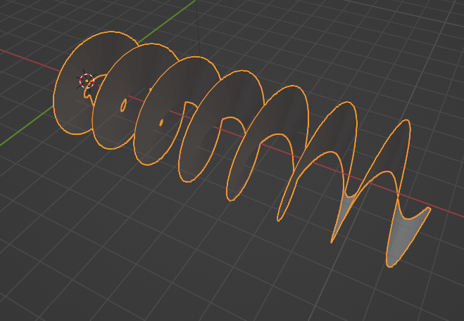
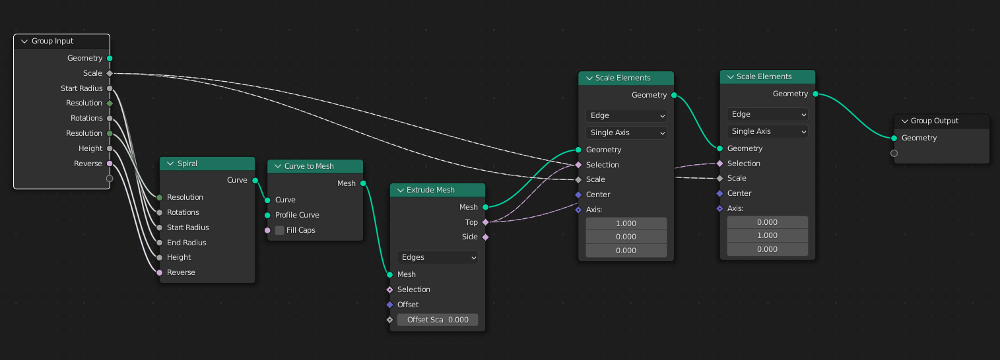

# Spiral Plane in Blender

A simple Blender geometry node generating a spiral plane.
We use it to represent optical angular momentum. 

## How it works

1. Generate a spiral curve;
2. Curve to mesh node transforms it into edges and vertex;
3. Extrude edges. Here we set offset = 0, so the new edges generated by extruding 
operation stay in the original position;
4. Scale the new edges in x-y axis, the faces defined by extruding will extend with the scaling of new edges.

